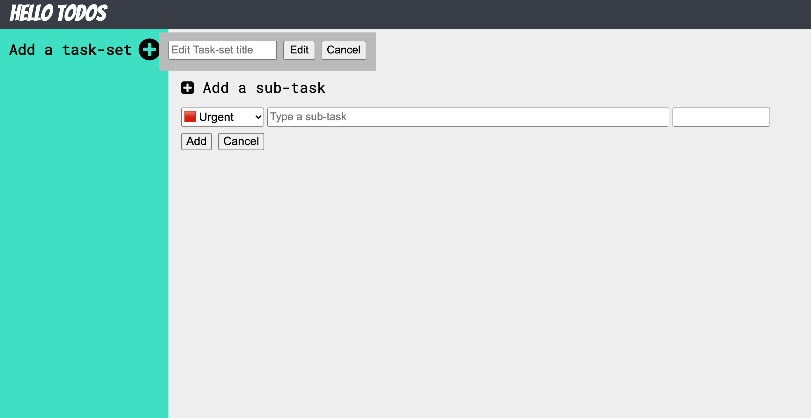

# To-do-list

<!-- ABOUT THE PROJECT -->

## About The Project

 This is a simple ‘todos’ list app by using factories or constructors/classes to generate them. It has a title, dueDate and priority and checklist. When a user first opens the app, there will have some sort of ‘default’ project to which all of their todos are put. Users should be able to create new projects and choose which project their todos go into.
The User Interface is theo the following:
 - view all projects
 - view all todos in each project
 - delete a todo
 
 
</a>

### Built With

- [HTML]
- [CSS]
- [JAVASCRIPT]
- [VUE]
- [WEBPACK]

<!-- LICENSE -->

## License

Distributed under the MIT License. See `LICENSE` for more information.
